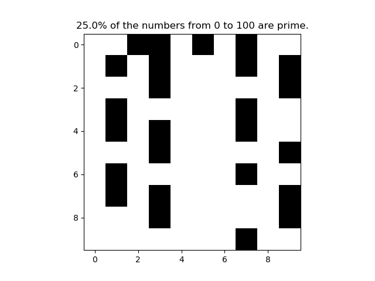
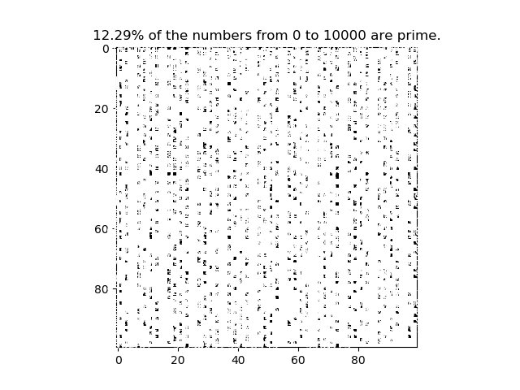
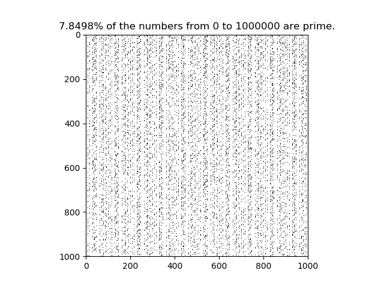

# Prime Grid

This Python script generates a square grid with a given size and fills in black squares if the number is prime at that location.

## To Use

Clone repository and run the script in its location.

The program will prompt you about the size of grid you want to use (must be a perfect square) Example: 16

Then you'll be asked if you want numbers displayed on the prime number. "Y" for yes, "N" for no. WARNING: Displaying numbers will slow down the process of creating the graph, if you are creating very large grids, it may take more than a few seconds to generate.

## Examples

**10x10 square grid (labeled)**

**10x10 square grid (unlabeled)**

**100x100 square grid (labeled)**

**1000x1000 square grid (unlabeled)**

